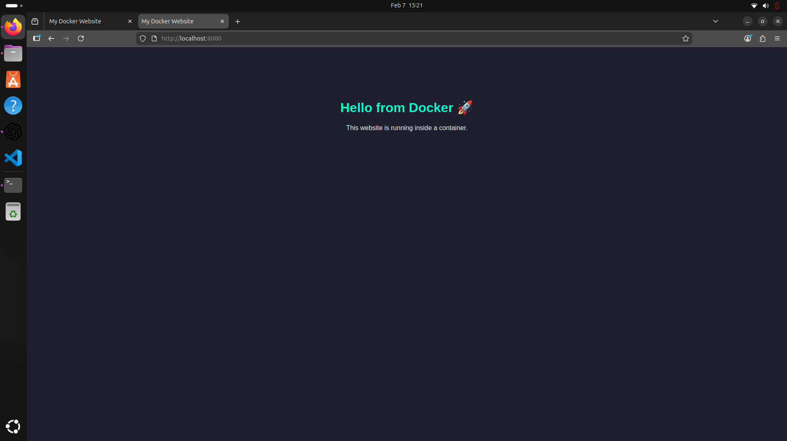

# Static Website using Docker

## Project Preview

## Project Description
This project demonstrates containerization of a static HTML/CSS website using Nginx and Docker.

## How to Run

Build image:
docker build -t my-static-site .

Run container:
docker run -d -p 8080:80 --name my-website my-static-site

Access:
http://localhost:8080
